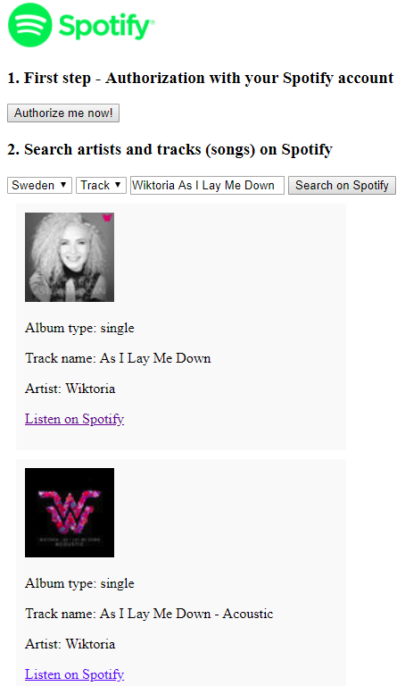

# Advance JS - GSpotifySearch
* The simple example web app which using Spotify API
* Pure JavaScript version ([`pure-js branch`](https://github.com/nguyenkhois/advjs-spotifysearch/tree/pure-js) - [Demo](https://nguyenkhois.github.io/advjs-spotifysearch/demo-purejs/))
* jQuery version (master branch - [Demo](https://nguyenkhois.github.io/advjs-spotifysearch/public/))

## Screenshot

## Using
* Please read carefully before using this example:
    * Create and sign in your account on [Spotify](https://www.spotify.com/).
    * Get your `client_id` and config `redirect_uri` in your Dashboard on [Spotify Development](https://beta.developer.spotify.com/) then change these variables values in `src/index.js` before you rebuild this app for end result.
    * View more information on [Spotify - App Settings](https://beta.developer.spotify.com/documentation/general/guides/app-settings/)
* [Read more about jQuery - Ajax](http://api.jquery.com/jquery.ajax/)

## Changelog
### Version beta 1 (2018-04-03)
* Completed requirements for this example
    * Using Spotify API
    * Authorization
    * Get tracks/ artists from API
    * A link to Spotify for listening a track
    * Show error message when data not found
    * Show "image not found" when artist image or track image not found
* Extra works
    * Search by chosen market (Sweden or US)

## References for API
* [Spotify - Authorization Scopes](https://beta.developer.spotify.com/documentation/general/guides/scopes/)
* [Spotify - Search for an Item](https://beta.developer.spotify.com/documentation/web-api/reference/search/search/)
* [Spotify - Design Resources](https://developer.spotify.com/design/)
